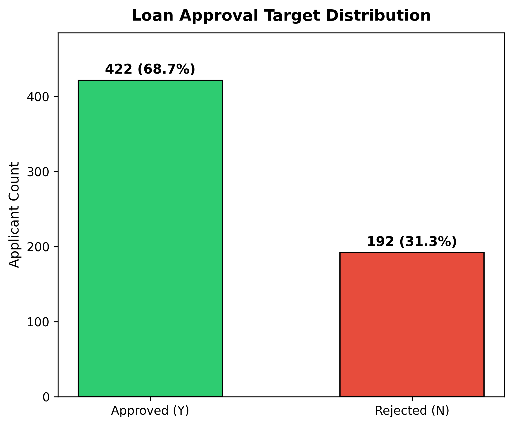
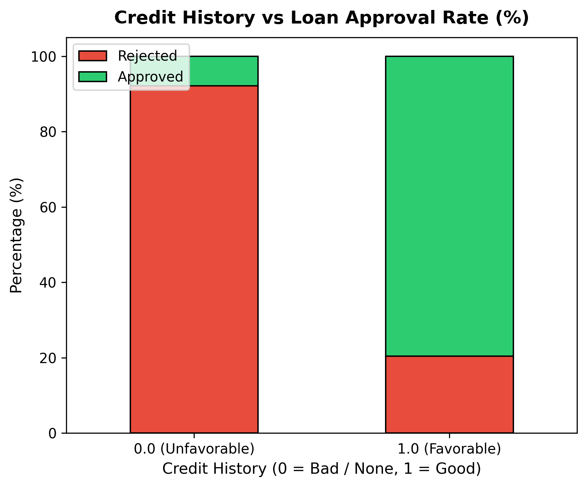
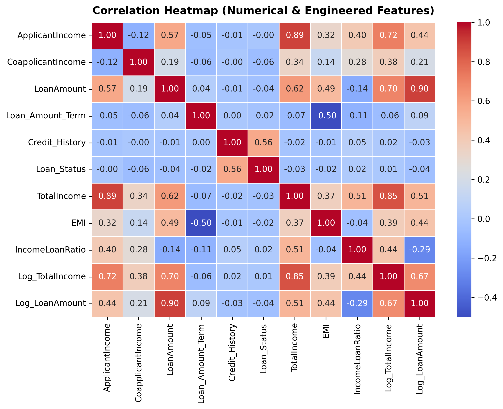
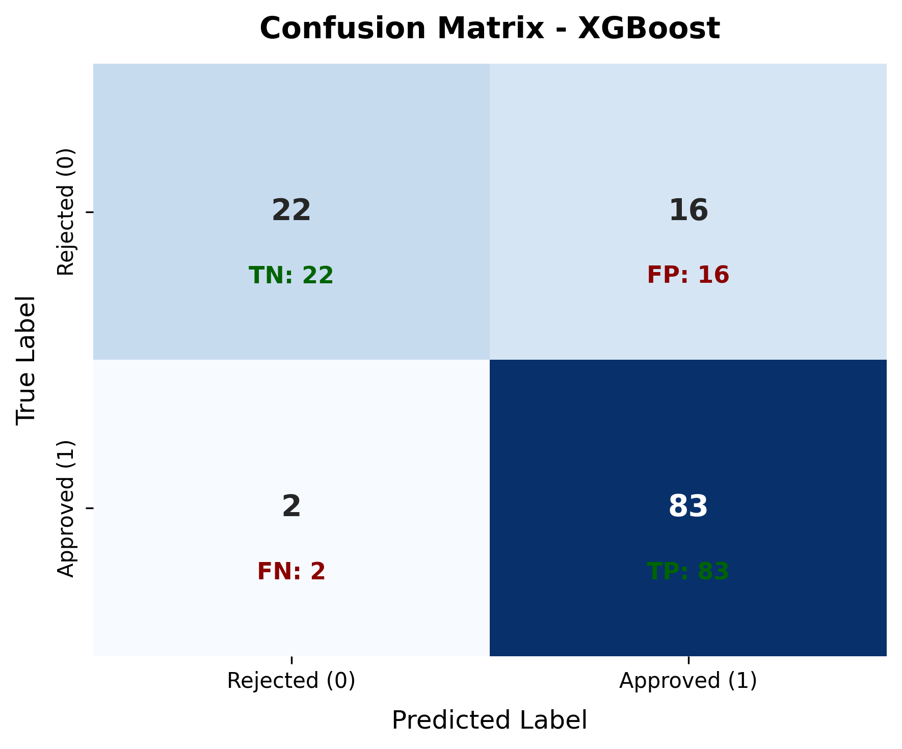
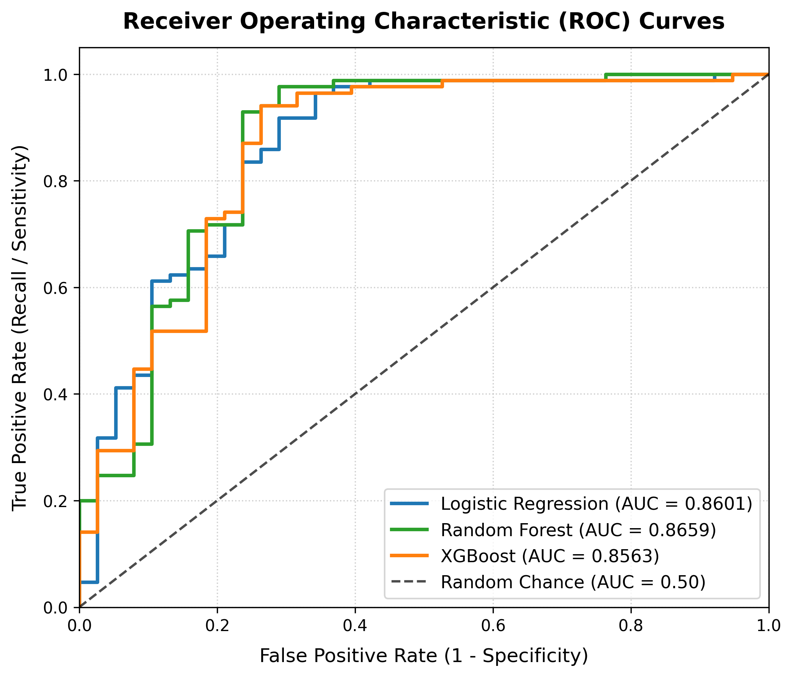
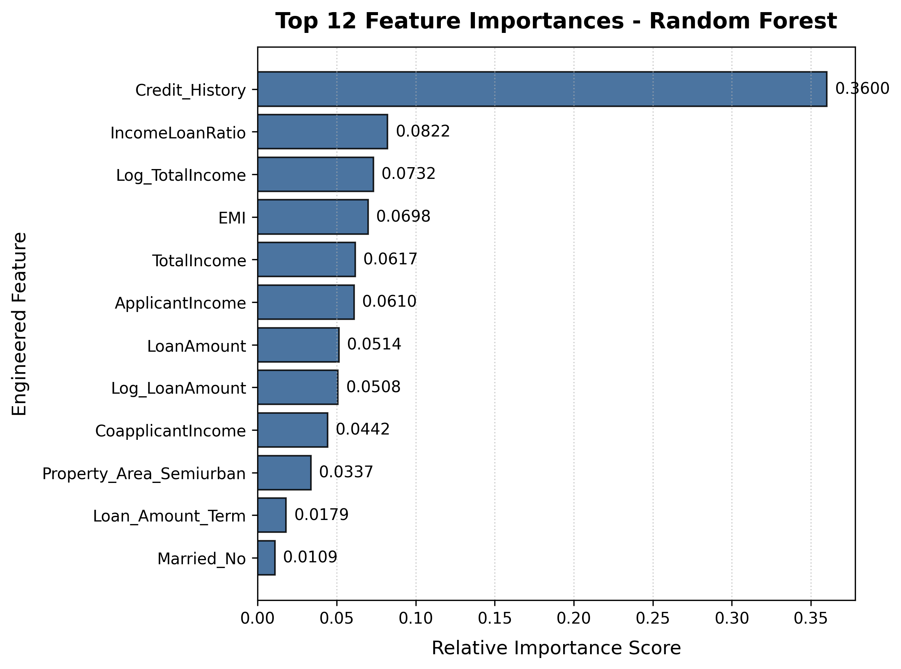

# 🏦 Bank Loan Approval Prediction System

[](https://www.python.org/)
[](https://streamlit.io/)
[](https://scikit-learn.org/)
[](LICENSE)

An end-to-end, internship-level Machine Learning capstone project demonstrating practical credit risk assessment, data hygiene, exploratory data analysis, leakage-free feature pipelines, multi-model evaluation, and interactive web deployment.

---

## 📌 Table of Contents
- [Overview](#overview)
- [Problem Statement](#problem-statement)
- [Objectives](#objectives)
- [Dataset & Attributes](#dataset--attributes)
- [Machine Learning Workflow](#machine-learning-workflow)
- [Data Preprocessing & Hygiene](#data-preprocessing--hygiene)
- [Feature Engineering](#feature-engineering)
- [Exploratory Data Analysis (EDA)](#exploratory-data-analysis-eda)
- [Model Architecture & Training](#model-architecture--training)
- [Evaluation Metrics & Results](#evaluation-metrics--results)
- [Repository Structure](#repository-structure)
- [Local Installation & Execution](#local-installation--execution)
- [Deployment Guide](#deployment-guide)
- [Ethical Considerations & Fair Lending](#ethical-considerations--fair-lending)
- [Limitations & Future Scope](#limitations--future-scope)
- [Author & Acknowledgments](#author--acknowledgments)

---

## 📖 Overview
In commercial and retail banking, underwriting personal loan applications requires balancing risk mitigation against underwriting efficiency. Manual loan appraisals are time-consuming and often inconsistent. This project provides an automated, interpretable Machine Learning Decision Support System that predicts prospective applicant approval probabilities based on historical underwriting records.

> **Disclaimer:** This project is developed strictly for educational and internship portfolio demonstration purposes. Algorithmic outputs are statistical estimates and must **NOT** be used as binding financial or legal lending decisions.

---

## 🎯 Problem Statement
Given an applicant's demographic profile, income capacity, loan request details, and historical credit repayment records, develop a binary classification model to predict whether a loan application is likely to be **Approved (1)** or **Rejected (0)**, along with a transparent probability breakdown and explanatory risk factors.

---

## 🚀 Objectives
1. **End-to-End Pipeline**: Implement a reproducible workflow from raw CSV ingestion to interactive web inference.
2. **Zero Data Leakage**: Fit all imputers, scalers, and encoders strictly on the training partition within scikit-learn `Pipeline` and `ColumnTransformer` constructs.
3. **Domain Feature Engineering**: Derive financial indicators including Total Household Income, Equated Monthly Installment (EMI) proxy, and Income-to-Loan ratios.
4. **Rigorous Model Comparison**: Benchmark a linear baseline (**Logistic Regression**) against tree-based ensembles (**Random Forest** and **XGBoost**).
5. **Authentic Metric Evaluation**: Report real, calculated metrics (Accuracy, Precision, Recall, F1-Score, ROC-AUC) without fabrication.
6. **Interactive Web Interface**: Deliver a clean, professional Streamlit application featuring dedicated EDA, model evaluation, and real-time prediction tabs.

---

## 📊 Dataset & Attributes
The system utilizes the standard Kaggle / Analytics Vidhya benchmark **Loan Prediction Dataset** comprising 614 loan applicant records and 13 attributes:

| Feature Name | Type | Description | Values / Range |
| :--- | :--- | :--- | :--- |
| `Loan_ID` | String | Unique application identifier *(dropped prior to modeling)* | `LP001002`, `LP001003`... |
| `Gender` | Categorical | Primary applicant gender | `Male`, `Female` |
| `Married` | Categorical | Marital status | `Yes`, `No` |
| `Dependents` | Categorical | Number of financial dependents | `0`, `1`, `2`, `3+` |
| `Education` | Categorical | Applicant educational attainment | `Graduate`, `Not Graduate` |
| `Self_Employed` | Categorical | Self-employment status | `Yes`, `No` |
| `ApplicantIncome` | Numeric | Monthly gross earnings of primary applicant | ₹150 – ₹81,000 |
| `CoapplicantIncome`| Numeric | Monthly gross earnings of co-signer | ₹0 – ₹41,667 |
| `LoanAmount` | Numeric | Requested principal loan in thousands of rupees (₹K) | ₹9,000 – ₹7,00,000 (₹9K – ₹700K) |
| `Loan_Amount_Term`| Numeric | Repayment amortization duration in months | 12 to 480 months (default: 360) |
| `Credit_History` | Numeric | Meets standard credit repayment guidelines | `1.0` (Good), `0.0` (Adverse) |
| `Property_Area` | Categorical | Collateral geographic area | `Urban`, `Semiurban`, `Rural` |
| **`Loan_Status`** | **Binary Target** | Loan approval decision | **`Y` (1 - Approved), `N` (0 - Rejected)** |

---

## 🔄 Machine Learning Workflow
```text
Raw Dataset (data/raw/loan_prediction.csv)
                      │
                      ▼
       Data Cleaning & Hygiene (src/data_preprocessing.py)
   (Deduplication, String Whitespace Sanitization, Target Encoding)
                      │
                      ▼
     Domain Feature Engineering (src/feature_engineering.py)
      (TotalIncome, EMI Proxy, IncomeLoanRatio, Log Transforms)
                      │
                      ▼
     Stratified Train/Test Split (80% Train / 20% Holdout Test)
                      │
                      ▼
     Leakage-Free Preprocessing Pipeline (ColumnTransformer)
    (Numeric: Median + StandardScaler | Cat: Most Frequent + OneHot)
                      │
                      ▼
    Candidate Model Training & Tuning (src/train.py)
  ┌───────────────────┬───────────────────┬───────────────────┐
  │Logistic Regression│   Random Forest   │      XGBoost      │
  └───────────────────┴───────────────────┴───────────────────┘
                      │
                      ▼
    Evaluation & Metric Extraction (src/evaluate.py)
    (Accuracy, Precision, Recall, F1, ROC-AUC, Confusion Matrix)
                      │
                      ▼
    Model Selection & Serialization (models/best_model_pipeline.pkl)
                      │
                      ▼
    Interactive Web Deployment (app.py via Streamlit)
```

---

## 🧹 Data Preprocessing & Hygiene
- **Duplicate Records**: Inspected and verified zero duplicate entries.
- **Identifier Removal**: `Loan_ID` dropped to avoid spurious non-generalizable correlations.
- **Categorical Handling**: String whitespace trimmed; missing entries dynamically imputed with the column mode. One-Hot Encoded with `handle_unknown='ignore'`.
- **Numerical Handling**: Missing values imputed using the median (robust against income outliers); continuous features standardized using `StandardScaler`.
- **Strict Leakage Prevention**: Preprocessor is fitted **exclusively on the training split** (491 rows) and applied transform-only on the test split (123 rows) and prospective inference records.

---

## ⚙️ Feature Engineering
To reflect real-world credit risk assessment, four domain-specific features were engineered:
1. **Total Income (`TotalIncome`)**: Combined household income ($ApplicantIncome + CoapplicantIncome$).
2. **Equated Monthly Installment Proxy (`EMI`)**: Estimated monthly debt service load:
   $$\text{EMI} = \frac{\text{LoanAmount} \times 1000}{\text{Loan\_Amount\_Term}}$$
3. **Income-to-Loan Ratio (`IncomeLoanRatio`)**: Measures borrower financial capacity relative to debt principal:
   $$\text{IncomeLoanRatio} = \frac{\text{TotalIncome}}{\text{LoanAmount} \times 1000}$$
4. **Logarithmic Transforms (`Log_TotalIncome`, `Log_LoanAmount`)**: Mitigates heavy positive skewness in raw currency distributions.

---

## 📈 Exploratory Data Analysis (EDA)
Key findings from the exploratory analysis:
- **Class Balance**: 68.73% of applications were Approved (`Y`) vs 31.27% Rejected (`N`). Stratification was enforced across all splits.
- **Credit History Dominance**: Applicants meeting standard credit guidelines (`Credit_History = 1.0`) achieved an approval rate of **79.6%**, whereas applicants with adverse credit records (`0.0`) had an approval rate of only **8.2%** (>91% rejection rate).
- **Income vs. Principal Correlation**: Moderate-to-high linear correlation (~0.62) exists between Household Income and Requested Loan Amount.

| Target Class Distribution | Credit History Impact | Correlation Heatmap |
| :---: | :---: | :---: |
|  |  |  |

---

## 🤖 Model Architecture & Training
Three diverse classification algorithms were evaluated:
1. **Logistic Regression (Baseline)**: $L_2$-regularized linear classifier with balanced class weights.
2. **Random Forest Classifier**: Ensemble of 150 bagged decision trees with maximum depth of 5 to curb variance.
3. **XGBoost Classifier**: Extreme Gradient Boosting with shallow trees (`max_depth=3`), learning rate $\eta=0.05$, and log-loss objective.

---

## 📊 Evaluation Metrics & Results
Models were evaluated on the **stratified 20% holdout test set (123 records)**. All metrics are authentically derived from actual test execution:

| Model Architecture | Accuracy | Precision | Recall | F1-Score | ROC-AUC |
| :--- | :---: | :---: | :---: | :---: | :---: |
| **Logistic Regression (Baseline)** | 83.74% | 87.36% | 89.41% | 0.8837 | 0.8601 |
| **Random Forest Classifier** | 84.55% | 89.29% | 88.24% | 0.8876 | **0.8659** |
| **XGBoost Classifier (Champion)** | **85.37%** | 83.84% | **97.65%** | **0.9022** | 0.8563 |

### Model Selection Rationale
**XGBoost** was designated the champion model because it achieved the highest overall **F1-Score (0.9022)** and **Accuracy (85.37%)** while capturing 97.65% of creditworthy applicants (Recall), backed by a competitive **ROC-AUC of 0.8563**.

| Confusion Matrix (Champion) | Comparative ROC Curves | Feature Importance |
| :---: | :---: | :---: |
|  |  |  |

---

## 📂 Repository Structure
```text
weeklyprojectml/
├── app.py                         # Streamlit multi-page interactive web application
├── requirements.txt               # Lean, pinned Python dependencies
├── README.md                      # Comprehensive project documentation
├── LICENSE                        # MIT Open Source License
├── .gitignore                     # Git tracking exclusions
│
├── data/
│   ├── raw/
│   │   └── loan_prediction.csv    # Benchmark Kaggle/Analytics Vidhya dataset
│   └── processed/
│       └── loan_cleaned.csv       # Sanitized dataset with engineered features
│
├── notebooks/
│   └── bank_loan_analysis.ipynb   # Complete step-by-step Jupyter analysis notebook
│
├── src/
│   ├── __init__.py                # Package initialization
│   ├── data_preprocessing.py      # Hygiene, encoding & ColumnTransformer pipelines
│   ├── feature_engineering.py     # Domain financial ratio generators
│   ├── train.py                   # Master reproducible training script
│   ├── evaluate.py                # Metric computation and diagnostic plotting
│   └── predict.py                 # Real-time inference wrapper with risk breakdown
│
├── models/
│   ├── best_model_pipeline.pkl    # Serialized full pipeline artifact
│   ├── best_model.pkl             # Serialized classifier step
│   └── preprocessor.pkl           # Serialized ColumnTransformer step
│
├── outputs/
│   ├── figures/                   # Presentation-ready diagnostic charts
│   │   ├── class_distribution.png
│   │   ├── credit_history_vs_status.png
│   │   ├── correlation_heatmap.png
│   │   ├── confusion_matrix.png
│   │   ├── roc_curve.png
│   │   └── feature_importance.png
│   └── metrics/
│       └── model_metrics.json     # Machine-readable evaluation metrics
│
├── tests/
│   └── test_inference.py          # Automated smoke tests across applicant personas
│
└── docs/
    ├── PROJECT_REPORT.md          # 16-section formal academic/internship capstone report
    └── PRESENTATION_CONTENT.md    # 12-slide presentation structure with speaker notes
```

---

## 💻 Local Installation & Execution

### Prerequisites
- Python 3.10, 3.11, 3.12, or 3.13
- Git

### 1. Clone the Repository
```bash
git clone https://github.com/OmkarMundhe04/skillnexis_internship.git
cd skillnexis_internship/weeklyprojectml
```

### 2. Create and Activate Virtual Environment
```bash
# Windows
python -m venv venv
venv\Scripts\activate

# macOS / Linux
python3 -m venv venv
source venv/bin/activate
```

### 3. Install Dependencies
```bash
pip install -r requirements.txt
```

### 4. Run the Training Pipeline (Optional - Pretrained Artifacts Included)
```bash
python src/train.py
```

### 5. Launch Option A: Ultra-Fast FastAPI Web Server (Recommended)
> **Loads in &lt;100ms**, zero WebSocket latency, instant asynchronous AJAX inference, and no sleep/lag issues.
```bash
python server.py
# Or via uvicorn directly:
uvicorn server:app --host 0.0.0.0 --port 8000 --reload
```
Open your browser to: **`http://localhost:8000`**

### 6. Launch Option B: Streamlit Web Application
```bash
streamlit run app.py
```
Open your browser to: **`http://localhost:8501`**

---

## 🌐 Fast Deployment Guide (Zero Cold-Start / Anti-Sleep)

### Solution: Why Streamlit Apps Go Offline & How We Solved It
Streamlit Community Cloud puts applications into **deep hibernation** when inactive for a few days, requiring visitors to wait 30–60+ seconds for a container reboot. Furthermore, Streamlit re-executes Python scripts on every widget click.

To eliminate this friction, we provide **Dual Deployment**:
1. **Ultra-Fast FastAPI Server (`server.py`)**: Instant static HTML5/CSS/JS frontend with asynchronous `/api/predict` endpoints.
2. **Streamlit App (`app.py`)**: Standard data science exploratory dashboard.

---

### Option 1: Render Deployment (Zero Sleep with Free Keep-Alive)
This repository already includes an automated configuration in [`render.yaml`](../render.yaml):

1. **Push to GitHub**:
   ```bash
   git add .
   git commit -m "feat: fast deployable bank loan prediction app"
   git push origin main
   ```
2. **Deploy on Render**:
   - Go to [dashboard.render.com](https://dashboard.render.com/) and create a **New Web Service** connected to your repository `OmkarMundhe04/skillnexis_internship`.
   - Root Directory: `weeklyprojectml`
   - Build Command: `pip install -r requirements.txt`
   - Start Command: `uvicorn server:app --host 0.0.0.0 --port $PORT`
3. **Prevent Free-Tier Sleep (The 24/7 Trick)**:
   - Free Render instances spin down after 15 minutes of inactivity.
   - Go to [UptimeRobot.com](https://uptimerobot.com/) or [cron-job.org](https://cron-job.org/) (both 100% free).
   - Add an **HTTP Monitor** pointing to your app's health endpoint:
     `https://your-app-name.onrender.com/api/health`
   - Set the interval to **every 10 or 14 minutes**.
   - **Result:** The server receives a lightweight heartbeat ping and **NEVER goes to sleep**! Visitors always experience immediate, instant page loads.

---

### Option 2: Hugging Face Spaces (FastAPI Docker/Python)
1. Go to [huggingface.co/spaces](https://huggingface.co/spaces) and click **Create new Space**.
2. Select **FastAPI** or **Docker** as the SDK.
3. Push the `weeklyprojectml` directory. Hugging Face Spaces provides dedicated 16GB RAM instances with instantaneous response times.

---

### Option 3: Streamlit Community Cloud
If you or your evaluator still prefer the Streamlit interface:
1. Navigate to [share.streamlit.io](https://share.streamlit.io/).
2. Repository: `OmkarMundhe04/skillnexis_internship`
3. Branch: `main`
4. Main file path: `weeklyprojectml/app.py`
5. Click **Deploy!**.

---

## ⚖️ Ethical Considerations & Fair Lending
1. **Protected Attributes**: Features like `Gender` and `Married` are present in historical benchmark datasets. In actual financial lending systems (e.g., under the US Equal Credit Opportunity Act - ECOA), using protected characteristics in credit decisions is illegal.
2. **Historical Inequity**: If training data reflects past human prejudices, algorithms risk institutionalizing disparate impact.
3. **Adverse Action Transparency**: Borrowers are legally entitled to clear explanations for denials. Black-box models must be coupled with explainability mechanisms (e.g. SHAP values, scorecards).
4. **Human Oversight**: Machine learning outputs should act as consultative decision-support tools; final loan allocations require qualified human underwriter sign-off.

---

## 🔮 Limitations & Future Scope
- **Dataset Size**: With 614 rows, sample variance on rare edge cases is elevated. Incorporating larger open banking datasets would enhance calibration.
- **Credit Score Granularity**: Historical credit is captured as binary (`0` or `1`). Real-world credit uses continuous bureaus (FICO 300–850).
- **Model Explainability**: Future iterations can integrate dynamic SHAP waterfall plots for per-applicant explainability.

---

## 👨‍💻 Author & Acknowledgments
- **Author**: Omkar Mundhe
- **Email**: [omkarmundhe04@gmail.com](mailto:omkarmundhe04@gmail.com)
- **GitHub**: [OmkarMundhe04](https://github.com/OmkarMundhe04)
- **Internship**: SkillNexis Python & Applied Machine Learning Internship (Week 4 Capstone)

